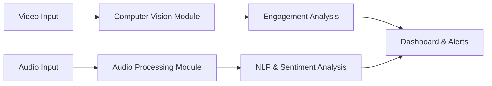

# EngageAI Classroom

[](https://opensource.org/licenses/MIT)
[]()

> **Real-time AI-powered system to analyze teacher engagement and student responses in classroom environments.**  
> Combining computer vision, audio processing, and natural language processing to enhance educational insights.

---

## Table of Contents

- [Project Overview](#project-overview)  
- [Features](#features)  
- [Architecture](#architecture)  
- [Tech Stack](#tech-stack)  
- [Installation](#installation)  
- [Usage](#usage)  
- [Demo](#demo)  
- [Roadmap](#roadmap)  
- [Contributing](#contributing)  
- [License](#license)  
- [Contact](#contact)

---

## Project Overview

EngageAI Classroom aims to empower educators and institutions by providing real-time analytics on teaching and student engagement. Using video and audio data captured from classroom sessions, the system detects teacher gestures and voice tones while monitoring student attention and participation.

By analyzing multi-modal signals — visual cues from teacher and students, audio signals of speech and tone, and textual sentiment from interactions — the project helps quantify classroom dynamics to improve teaching effectiveness and student learning outcomes.

---

## Features

- **Teacher Engagement Analysis**  
  Detects gestures, posture, and voice tone to infer teaching style and enthusiasm.

- **Student Attention Monitoring**  
  Tracks eye gaze, head pose, and physical cues to estimate attention levels.

- **Participation Detection**  
  Recognizes raised hands, speaking activity, and question frequency.

- **Speech-to-Text and Sentiment Analysis**  
  Converts spoken responses into text and performs sentiment classification.

- **Interactive Dashboard** *(future)*  
  Visualizes real-time classroom engagement metrics and analytics.

---

## Architecture


---

## Tech Stack

| Component          | Technology/Library            | Purpose                                      |
|--------------------|-------------------------------|----------------------------------------------|
| Programming Language | Python                      | Core implementation                          |
| Computer Vision      | OpenCV, MediaPipe           | Face detection, gesture tracking             |
| Audio Processing     | Librosa, SpeechRecognition  | Voice tone analysis, speech-to-text          |
| NLP & Sentiment      | HuggingFace Transformers, NLTK | Text sentiment from speech                |
| Dashboard/UI         | Streamlit                   | Real-time engagement dashboard (planned)     |
| Others               | NumPy, Matplotlib           | Data handling & visualization                |


---

## Installation

### Prerequisites

- Python 3.8 or higher
- Git installed
- A webcam and microphone for input

### Steps

1. **Clone the repository**

```bash
git clone https://github.com/AnilVadthyavath/EngageAI-Classroom.git
cd EngageAI-Classroom
```
---

## Usage

Once the setup is complete and dependencies are installed, you can run the project with:

```bash
python main.py
```
---

## Demo

> ⚠️ This section will be updated once visual demos are ready.

### Planned Demo Elements

- 📷 **Teacher Gesture Detection** (Real-time MediaPipe visualization)
- 🧠 **Student Attention Tracker** (Eye gaze + head pose)
- 🎤 **Speech-to-Text & Sentiment** (Voice responses converted to text and classified)
- 📊 **Streamlit Dashboard** (Engagement stats, alerts, and graphs)

### Screenshots (coming soon)

You can later add screenshots or GIFs like:

```markdown


```
---

## Roadmap

Here’s the development plan for EngageAI Classroom:

### ✅ Phase 1 – Core Setup & Vision Module

- [x] Create project structure & initialize GitHub repo
- [x] Setup webcam-based video stream
- [x] Implement teacher face and gesture detection using MediaPipe

### 🚧 Phase 2 – Student Attention & Audio Analysis

- [ ] Add eye gaze and head pose estimation for students
- [ ] Track speaking/participation through mic input
- [ ] Convert speech to text using SpeechRecognition API
- [ ] Run sentiment analysis on student responses (HuggingFace/NLTK)

### 🔮 Phase 3 – Visualization & Dashboard

- [ ] Build Streamlit dashboard to show:
  - Teacher activity score
  - Student attention rate
  - Engagement trends over time
- [ ] Add heatmaps and bar graphs for visual understanding

### 🚀 Phase 4 – Model Training & Data Collection

- [ ] Collect sample classroom session videos
- [ ] Annotate for engagement labels
- [ ] Fine-tune transformer-based models for classroom NLP tasks

### 🛡️ Final Touches

- [ ] Optimize for real-time performance
- [ ] Add error handling & logging
- [ ] Prepare for deployment or integration with LMS platforms

---

## Contributing

We welcome contributions that help make **EngageAI Classroom** better for educators and learners.

Whether you're improving the models, fixing bugs, or enhancing documentation—your effort matters!

### 🚀 How to Contribute

1. **Fork the repository**

2. **Create a feature branch**

```bash
git checkout -b feature/your-feature-name
```

3. **Make your changes and commit**

```bash
git commit -m "Add: your feature description"
```

4. **Push your branch**

```bash
git push origin feature/your-feature-name
```

5. **Open a Pull Request (PR)** on GitHub and describe what you’ve done.

---

### 💡 Contribution Ideas
```
* Improve student attention detection models
* Build the engagement dashboard with Streamlit
* Add facial expression or voice emotion detection
* Add demo classroom video datasets
* Write tests or documentation
* Fix bugs or refactor code

> If you're new to open-source, this project is beginner-friendly!  
> Feel free to open an issue before starting to discuss your idea.

```

---

## License

This project is licensed under the MIT License.  
See the [LICENSE](LICENSE) file for details.

---

**MIT License** grants permission to use, copy, modify, merge, publish, distribute, sublicense, and/or sell copies of the software, under the following conditions:

- The above copyright notice and this permission notice shall be included in all copies or substantial portions of the Software.  
- THE SOFTWARE IS PROVIDED "AS IS", WITHOUT WARRANTY OF ANY KIND, EXPRESS OR IMPLIED.

---

## Contact
  
GitHub: [AnilVadthyavath](https://github.com/AnilVadthyavath)  
LinkedIn: [vadthyavathanil](https://linkedin.com/in/vadthyavathanil)  
Email: vadthyavathanil.ai@gmail.com 

Feel free to reach out for collaborations, questions, or feedback!


